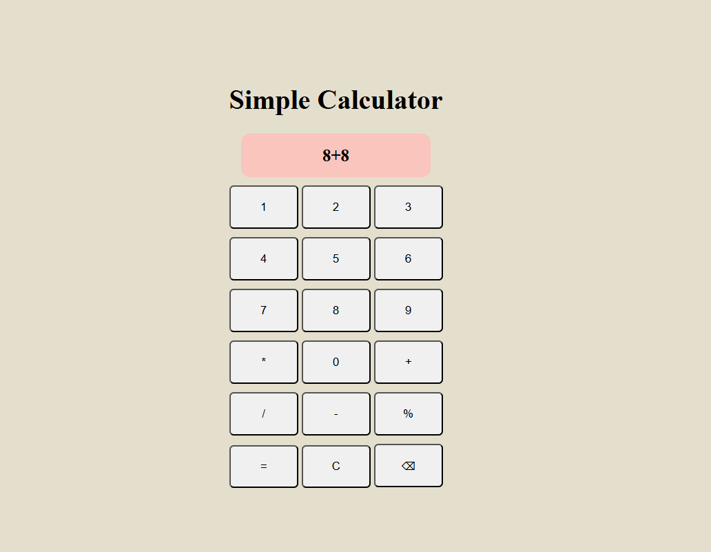

# 🧮 Simple Calculator

A **basic web-based calculator** built using **HTML, CSS, and JavaScript**.  
This project performs simple arithmetic operations such as addition, subtraction, multiplication, division, and modulus.  
It also includes functionalities for clear, backspace, and equals operations.

---

## 🚀 Features

- Perform addition, subtraction, multiplication, division, and modulus operations  
- Clear button (C) to reset input  
- Backspace (⌫) to delete the last character  
- Equals (=) to evaluate expressions  
- Simple, user-friendly, and responsive interface  

---

## 🧠 Project Overview

The Simple Calculator project is designed to help beginners understand the basics of web development using HTML, CSS, and JavaScript.  
It demonstrates how to build a functional calculator that can handle arithmetic operations and dynamically update the display using DOM manipulation.

---

## 🧩 Project Structure

- **index.html** — Defines the structure and layout of the calculator interface  
- **style.css** — Adds styling, alignment, colors, and hover effects  
- **script.js** — Contains the logic for performing calculations, clearing, backspacing, and updating the result display  

---

## ⚙️ How to Run the Project

1. Download or clone the repository to your local system.  
2. Open the project folder.  
3. Run the `index.html` file in any web browser.  
4. Use the on-screen buttons to perform calculations.  

---

## 📸 Screenshot

 

Example:  

---

## 💡 Future Enhancements

- Add support for keyboard input  
- Implement dark/light themes  
- Improve mobile responsiveness  
- Introduce advanced scientific calculator features (square root, power, etc.)  

---

## 🧑‍💻 Author

**Kanuganti Aakash**  
GitHub: [https://github.com/akashh_21](https://github.com/akashh_21)  
Email: kangantiakash@gmail.com  

---

## 🏁 Conclusion

This Simple Calculator demonstrates how HTML, CSS, and JavaScript can be combined to create an interactive web application.  
It serves as an excellent beginner-friendly project to understand event handling, DOM manipulation, and UI design in web development.
